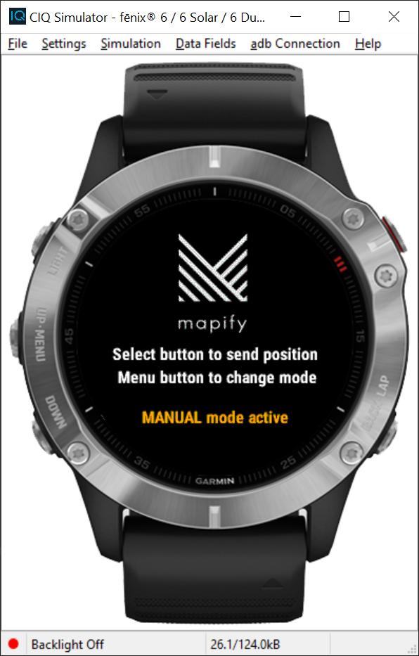

# garmin2mapify
Extremely simple [Connect IQ](https://apps.garmin.com) app made in [Monkey C](https://developer.garmin.com/connect-iq/monkey-c/) demonstrating how to send device data and its location to a [Mapify](https://www.mapify.ai/) data feed, allowing you to leverage Mapify to build amazing Garmin wearable devices based solutions.

> IMPORTANT: This example does not collect or send any personal information to Mapify, only technical and watch sensor data is being used. 




## Requirements

- Make sure you have a valid [Mapify account](https://www.mapify.ai).
- In your Mapify console generate an API Key with the Datafeed Messaging permission enabled and create a data feed to handle the incoming messages.
> Note: For the best initial experience you can create a Mapify Workflow which sends you an email everytime a message is received from your app.
- Download and install [Visual Studio Code](https://code.visualstudio.com/)
- Download and install the [Garmin Connect IQ SDK](https://developer.garmin.com/connect-iq/sdk/)
    - When adding devices to the SDK, be sure to include at least one of the following (you can add more if you want, but these were the devices I tested with):
        - Edge 520 Plus
        - Enduro
        - Fenix 6
        - Fenix 6 Pro
        - Fenix 6 S
        - Fenix 6 S Pro
- Download and install the [Visual Studio Code Monkey C Extension](https://marketplace.visualstudio.com/items?itemName=garmin.monkey-c)


## Usage

### Simulator

- In Visual Studio Code, open one of the ```.mc``` files from the ```source``` folder in the editor window
- Press Ctrl-F5 to run without debugging
- Select the target device from the list of available devices shown
- In your first time running the app in the simulator, [configure your Connect IQ application settings](./docs/application-settings.md)
- In VS Code, be sure the Debug Console tab is visible (for you to see what's happening)
- In the simulator, using your mouse cursor click the device button assigned to the Select operation.
- Check the Debug Console in VS Code. Your position has been sent to the configured Mapify Data feed :-)


### Device 

- Install the app from the [Connect IQ Store](https://apps.garmin.com/en-US/)
- [How to Access the Settings of Downloaded Connect IQ Content Using the Garmin Connect App](https://support.garmin.com/en-US/?faq=SPo0TFvhQO04O36Y5TYRh5)

- On your Garmin device, use a press of the Menu button to select between Manual and Automatic mode.
    - Manual mode: You need to press the Select button on your watch for your current sensor data and location to be sent to Mapify
    - Automatic mode: Wacth sensor data and location is automatically sent to Mapify regularly, using the time interval configured in the Application Settings in the Garmin Connect app (default is 3600 seconds).