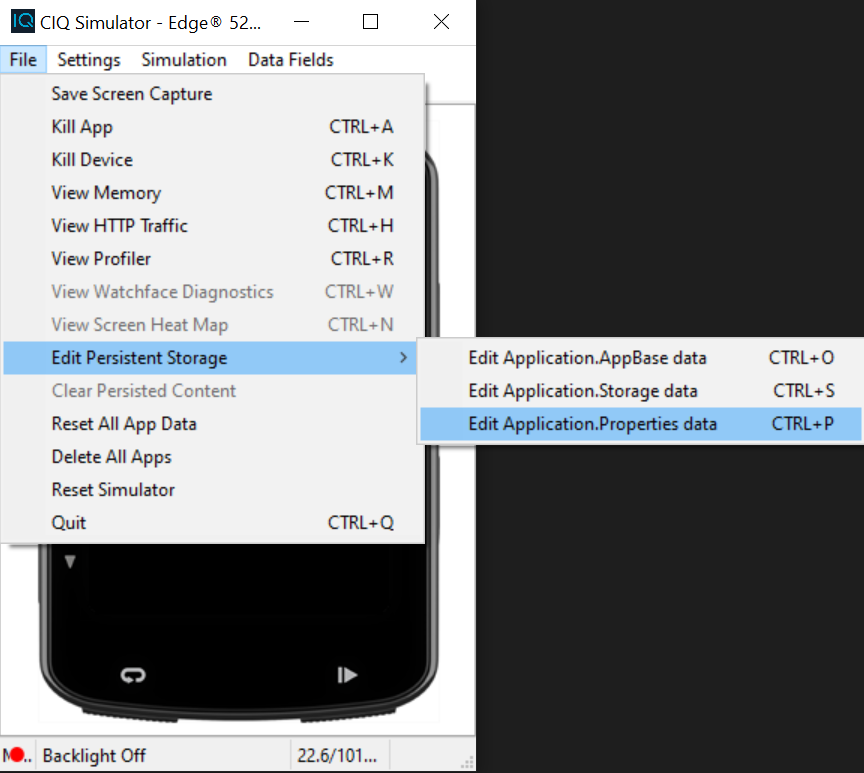
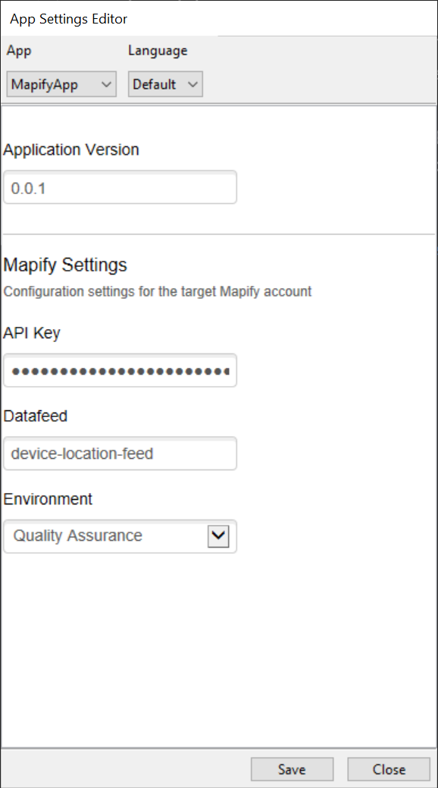

# garmin2mapify

## Configure your application settings

In your first use of the CIQ simulator with this app, you will need to set a couple of properties, such as the target Mapify environment and data feed name, and the Mapify Api Key (which must have data feed publishing permissions). 

When running the simulator for the first time, use the simulator menus to navigate to:

```File -> Edit Persistent Storage -> Edit Application.Properties data```



Make sure you have a valid Mapify account, generate an API Key with the Datafeed Messaging permission enabled and create a data feed to handle the incoming messages.

Use the Mapify data feed name and API key in the application settings:

